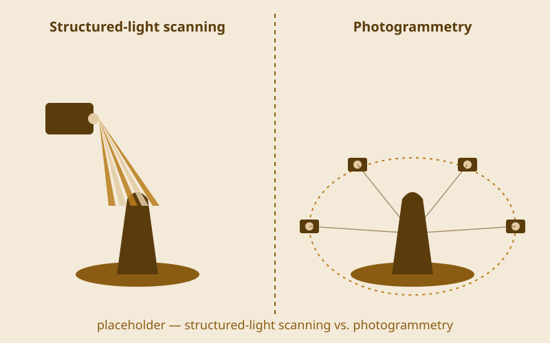

{/* _class: impact */}

# Round Trip

Sending matter through the machine and back

---

## The thesis

A piece of matter takes a round trip through digital process:

- **captured** — digitized off the physical world
- **transformed** — computed, or driven by a program
- **returned** — to physical form, or physical effect

Three pillars, one idea.

---

## The three pillars

1. Digitizing physical media — scanning, photogrammetry, projection
2. Programming — creative coding, then interactive systems
3. Physical computing — sensors, actuators, fabrication

Each brief asks you to combine, not choose one.

---

{/* _class: quote */}

> Neither a lecture course, nor a bootcamp for either half. A studio, run for
> both.

---

## Who this course assumes you are

Depth in **either**:

- physical or studio-art practice, **or**
- programming

Not both. Whichever half you don't have yet, the semester cross-trains it.

---

## Studio pairs

Today you're paired: one art-strength student, one code-strength student.

- each of you mentors the other's weaker half
- the pairing lasts the semester
- Studio Brief 1 (week 4) is the first place it shows up in what you submit

---

## Today, after this

- meet your pair
- get the toolchain running
- first look at the digitizing station — scanning and photogrammetry, from
  next week

---

## Digitizing flat artwork: lighting and framing

Lay the piece flat and light it evenly — one strong light source bakes a
shadow into the scan that was never part of the artwork.

Frame it square to the capture device, flatbed bed or a copy stand with the
camera aimed straight down, so you're not correcting for perspective
afterwards.

---

## Digitizing flat artwork: resolution and crop

Capture at a resolution that still holds up if the piece is reproduced
larger than the original.

Crop to the artwork's edge and correct any colour cast before calling the
digitizing step done.

---

## Scanning a 3D object: coverage

Set the object on a turntable, or walk around it with a camera, so every
side gets covered. A gap in coverage becomes a hole in the model, not
something fixed later.

---

{/* _class: landscape-split */}

## Two ways to capture the geometry

Structured-light scanning projects a striped pattern onto the object and
reads how the pattern bends across its surface. Photogrammetry skips the
projector entirely — an overlapping set of ordinary photos lets software
reconstruct the geometry from the parallax between them.

---

## Scanning a 3D object: capture and check

Move a consistent, small amount between captures — a big gap between
angles is what most often produces a hole in the model. Then check the
reconstructed model for holes or noise before moving on: rescanning a bad
angle now is faster than patching a mesh later.

---

## Construction methods: slotting

A tab on one piece, a slightly narrower slit on another. It's rigid,
demountable, and needs no adhesive.

---

## Construction methods: tabs and flaps

Fold flaps out from a piece and tape them to the inside of the adjoining
face. It's faster to build than slotting, and permanent once taped.

---

## Construction methods: scoring for curves

Score along the corrugation's grain, not across it, and cardboard bends
cleanly instead of creasing. This week's tutorial time uses all three
methods — slotting, tabs and flaps, and scoring — on your own scrap
object.

---

## What this can build toward: a fully hand-painted game

Every asset drawn by hand rather than photographed or scanned — the
"captured" step of the round trip can be digital pigment from the start,
if that's the pillar you're strong in.

---

## What this can build toward: projecting onto a scan

The object you scan today could end up exactly like this in week 2 —
computed imagery mapped onto its own irregular geometry rather than a flat
screen.

---

{/* _class: banner */}

## Next week

Digitizing Media I, continued — projection mapping
