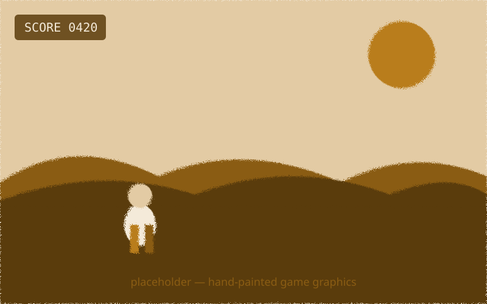
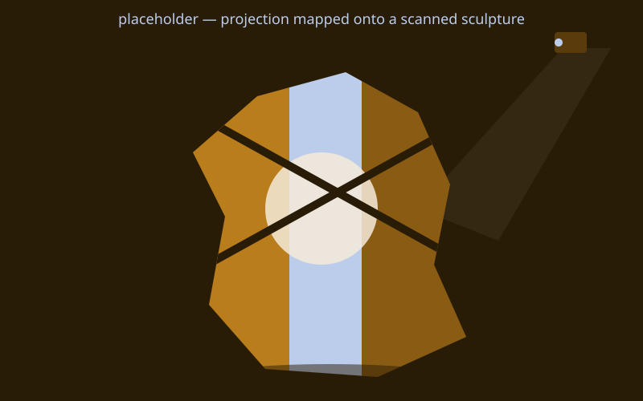

{/* _class: impact */}

# Round Trip

Sending matter through the machine and back

---

## The thesis

A piece of matter takes a round trip through digital process:

- **captured** — digitized off the physical world
- **transformed** — computed, or driven by a program
- **returned** — to physical form, or physical effect

Three pillars, one idea.

---

## The three pillars

1. Digitizing physical media — scanning, photogrammetry, projection
2. Programming — creative coding, then interactive systems
3. Physical computing — sensors, actuators, fabrication

Each brief asks you to combine, not choose one.

---

{/* _class: quote */}

> Neither a lecture course, nor a bootcamp for either half. A studio, run for
> both.

---

## Who this course assumes you are

Depth in **either**:

- physical or studio-art practice, **or**
- programming

Not both. Whichever half you don't have yet, the semester cross-trains it.

---

## Studio pairs

Today you're paired: one art-strength student, one code-strength student.

- each of you mentors the other's weaker half
- the pairing lasts the semester
- Studio Brief 1 (week 4) is the first place it shows up in what you submit

---

## Today, after this

- meet your pair
- get the toolchain running
- first look at the digitizing station — scanning and photogrammetry, from
  next week

---

## Digitizing methods, step by step: scanning flat artwork

1. Lay the piece flat and lit evenly — one strong light source bakes a
   shadow into the scan that was never part of the artwork.
2. Frame it square to the capture device — flatbed scanner bed, or a copy
   stand with the camera aimed straight down — so you're not correcting
   for perspective afterwards.
3. Capture at a resolution that still holds up if the piece is reproduced
   larger than the original.
4. Crop to the artwork's edge and correct any colour cast before calling
   the digitizing step done.

---

## Digitizing methods, step by step: scanning a 3D object

1. Set the object on the turntable, or walk around it with a camera, so
   every side gets covered — a gap in coverage becomes a hole in the
   model, not something fixed later.
2. **Structured-light scanning**: the station projects a striped pattern
   and reads how the object bends it. **Photogrammetry**: instead, take an
   overlapping set of ordinary photos and let software reconstruct the
   geometry from the parallax between them.
3. Move a consistent, small amount between captures — a big gap between
   angles is what most often produces the hole from step 1.
4. Check the reconstructed model for holes or noise before moving on —
   rescanning a bad angle now is faster than patching a mesh later.

---

## Construction methods: building with cardboard

- **Slotting** — a tab on one piece, a slightly-narrower slit on another:
  rigid, demountable, no adhesive.
- **Tabs and flaps** — fold flaps out, tape them to the inside of the
  adjoining face: fast, permanent.
- **Scoring for curves** — score along the corrugation's grain, not across
  it, and it bends cleanly instead of creasing.

The same three methods this week's tutorial time uses on your own scrap
object.

---

## What this can build toward: a fully hand-painted game

Every asset drawn by hand rather than photographed or scanned — the
"captured" step of the round trip can be digital pigment from the start,
if that's the pillar you're strong in.

---

## What this can build toward: projecting onto a scan

The object you scan today could end up exactly like this in week 2 —
computed imagery mapped onto its own irregular geometry rather than a flat
screen.

---

{/* _class: banner */}

## Next week

Digitizing Media I, continued — projection mapping
