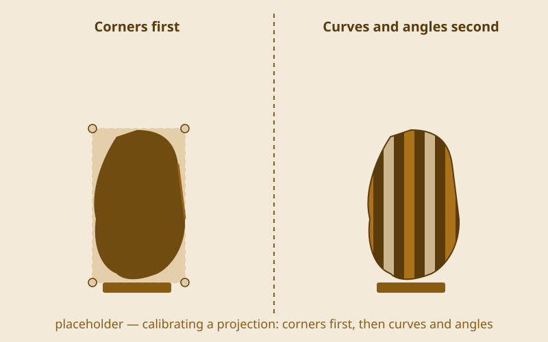
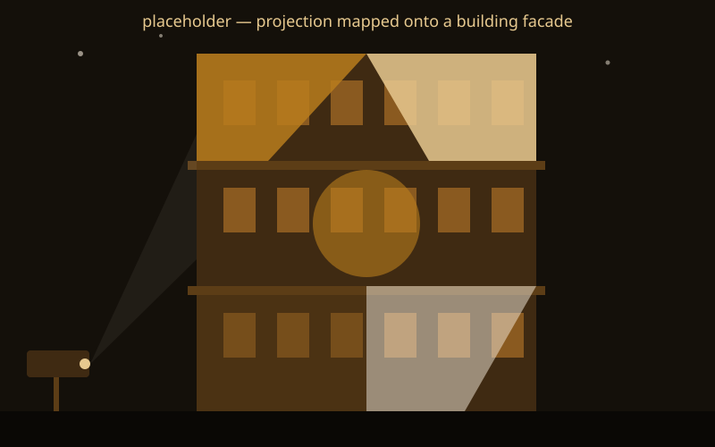
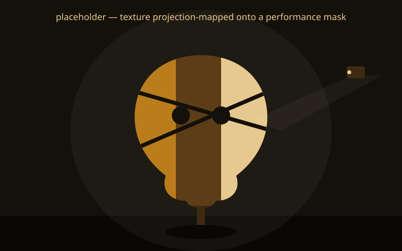

{/* _class: impact */}

# Projection Mapping

Throwing computed light back onto the physical surface you scanned

---

## Recap

- last week you captured a surface as data — this week you send computed
  light back onto that same kind of surface
- mapping a projector onto an irregular physical object, not a flat screen
- calibration: why a straight rectangle projected onto a curved object goes
  wrong, and how to fix it
- Studio Brief 1 opens today, asking you to combine this pillar with next
  week's programming on-ramp

---

## Setting up the station

Aim a projector at a stand or table where your object can sit still for
the rest of the session. Settle the object on that stand before you
calibrate, not after — a calibration only holds for one fixed relationship
between projector and object.

---

## Keeping the setup fixed

Treat both the object and the projector as fixed from here. A bump to
either means calibrating again from scratch.

---

## Calibrating: corners first, then curves

Match the projected image's corners to the object's outer edges first —
that gets position and scale roughly right. Then adjust for what a flat
grid can't predict: a curved face smears or doubles a straight-on image,
an angled face stretches it.

---

## Nudging it into place

Nudge the projection, or reshape the source image, until it sits on the
geometry you actually have rather than floating over it.

---

## From calibrated to captured

Map computed imagery onto the calibrated surface and it reads as part of
the object, not a rectangle of light sitting on top of it. Capture a
still image or clip before you strike the setup — a live projection only
exists in the room while it's running.

---

## What this can build toward: mapping a building facade

The same corners-then-curves calibration, scaled up: a computed light
pattern registered to a building's real windows and ledges, run after dark
as a public art piece.

---

## What this can build toward: a mapped performance prop

A mask or prop with a texture mapped onto its own irregular surface so it
reads as part of the object under stage lighting, live, in a performance.

---

{/* _class: banner */}

## Next week

Programming I — the p5.js creative-coding on-ramp, feeding into Studio
Brief 1
