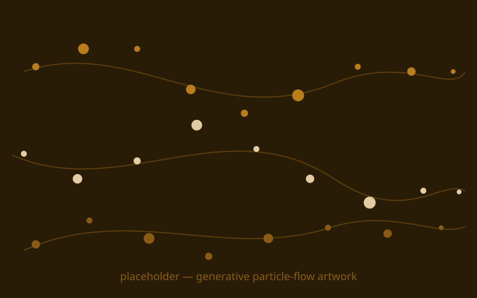
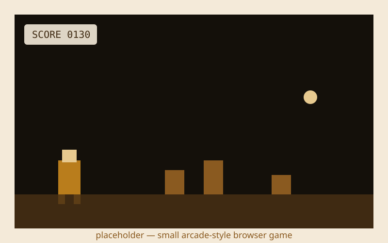

{/* _class: impact */}

# Creative Coding

Draw something, change a number, see the change — in the same second

---

## Recap

- p5.js's canvas, `setup()`/`draw()`, and a handful of shape functions — the
  whole starting vocabulary
- variables and simple interactivity: mouse position and time driving what
  gets drawn
- art-proficient half: this is your on-ramp, go slow and lean on what you
  already know about composition and colour
- programming-proficient half: today is about scouting what p5.js gives you
  for free, alongside mentoring your pair

---

## Building a sketch, step by step

1. Set up a canvas inside `setup()`.
2. Draw at least one shape inside `draw()`.
3. Drive something visible — position, size, or colour — off the mouse
   position or the clock rather than a fixed number.
4. When something breaks, ask your pair to point at the problem and explain
   it, then type the fix yourself.

---

## Scouting further, step by step

1. Push past the on-ramp shapes into what p5.js gives you for free.
2. Animate an array of objects inside the draw loop, rather than one shape.
3. Use a `p5.Vector` for motion instead of separate x/y maths.
4. Swap plain randomness for `noise()` to get organic movement.
5. Try the `WEBGL` renderer for a first 3D primitive.

---

## What this can build toward: a generative artwork

The same shapes and motion from today's sketch, scaled up into hundreds of
particles flowing along computed paths — a generative artwork rather than a
demo.

---

## What this can build toward: a small arcade game

A canvas, a sprite driven by input, and a score readout — the same
`setup()`/`draw()` loop from today, extended into a browser game.

---

{/* _class: banner */}

## Next week

Physical Computing I — reading sensors into a microcontroller, and Studio
Brief 1's crit
