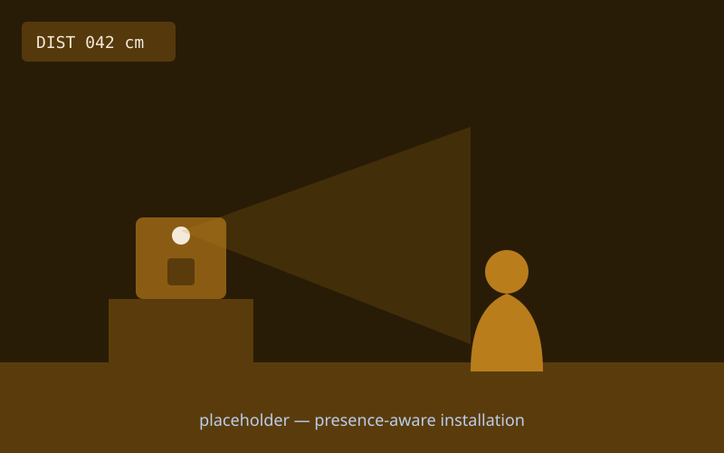
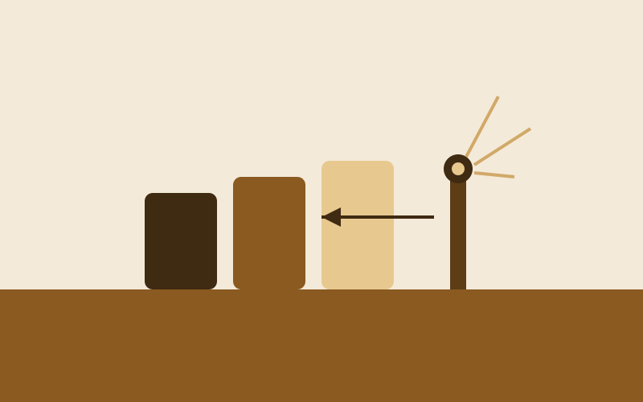

{/* _class: impact */}

# Sensors

Turning light, distance, motion or force into a number your code can use

---

## Recap

- physical computing opens with **input**: a microcontroller reading the
  world, not writing to it yet
- "reading a sensor" is a loop, not a one-off event — the board checks
  again and again
- a walkthrough of two or three common sensor types, and where each is a
  good fit
- today's crit looks at Studio Brief 1 — a digitizing technique combined
  with Programming I

---

## Reading a sensor, step by step

1. Wire the sensor to a pin — analog for a continuously varying signal
   (light, distance), digital for an on/off one (a button, some motion
   sensors).
2. Read the pin in a loop — `analogRead()` for analog, `digitalRead()`
   for digital — and you get back a raw number the sensor produced.
3. Print that raw number before anything else — a value you can see on
   screen is a value you can trust; one you can't see is a guess.
4. Map or scale the raw range onto the range you actually need — a
   `map()` from "0–1023 the pin reports" to "0–255 a brightness wants",
   for instance.
5. Only once the printed, scaled number moves the way you'd expect when
   you wave a hand or change the light, build anything else on top of it.

---

## What this can build toward: a presence-aware installation

A distance sensor watching the space in front of a small installation —
the piece stays still until someone steps close, then responds. The
whole behaviour is one scaled sensor reading, checked in a loop.

---

## What this can build toward: a quietly reactive object

A light or sound sensor reading driving a subtle, visible change in an
otherwise ordinary object — colour, brightness, or a small shift in
tone — proof that a sensor doesn't need a dramatic output to be worth
wiring up.

---

{/* _class: banner */}

## Next week

Physical Computing II — actuators: writing back out to the physical world
with motors, servos, LEDs and small speakers
