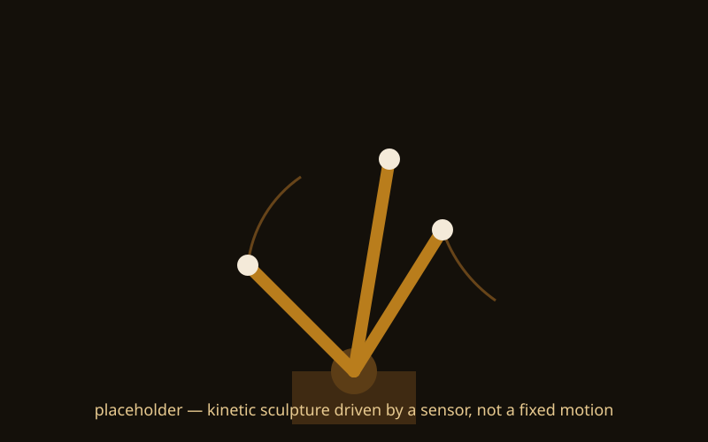
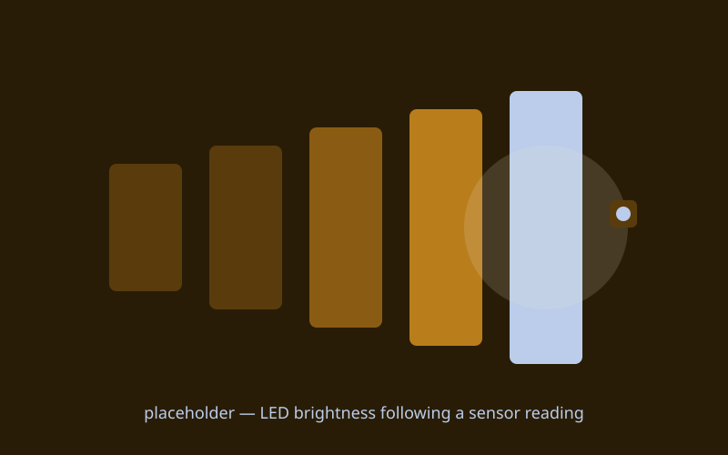

{/* _class: impact */}

# Actuators

The microcontroller stops reading the world and starts acting on it

---

## Recap

- driving a motor or servo from code, and why power supply is its own
  problem, not an afterthought
- combining a sensor from last week with an actuator this week: a
  minimal input-to-output loop
- what changes once the loop runs continuously rather than once — a
  preview of next week's bridging
- studio time: get a sensor-to-actuator loop running on your own board

---

## LED

Add a current-limiting resistor in series before power ever goes on.
Without one, it draws whatever the pin will give it and burns out in
seconds.

```cpp
analogWrite(ledPin, 128); // half brightness
```

---

## Motor

Drive it through a transistor or H-bridge, never straight off a pin —
a pin supplies a few tens of milliamps, a motor wants far more, so the
driver switches a separate supply instead.

---

## Servo

Wire power, ground, and one PWM signal pin. The width of the pulse on
that pin sets the angle, so the code side is close to one line once
it's wired correctly.

```cpp
servo.write(90); // angle in degrees
```

---

## Speaker (piezo)

A digital pin through a small resistor is enough — no driver needed.
It's the quickest actuator here for an early win.

---

## Closing the loop

Get a tutor to check the wiring before powering anything that draws
more current than the board supplies. Then close the loop: drive the
actuator's output from last week's sensor reading, not a hard-coded
value.

---

## What this can build toward: a kinetic sculpture that isn't on a timer



A hidden motor moves the piece, but the motion isn't a fixed loop — it's
driven by a sensor reading, so the sculpture's behaviour changes with
whatever's happening around it.

---

## What this can build toward: a responsive light installation



An LED array whose brightness or colour follows a sensor value in real
time — the same mapped-reading idea from week 4, now driving light
instead of a printed number.

---

{/* _class: banner */}

## Next week

Bridging — serial comms: getting sensor data off the microcontroller and
into the creative-coding and digitizing pipelines from weeks 1–3
