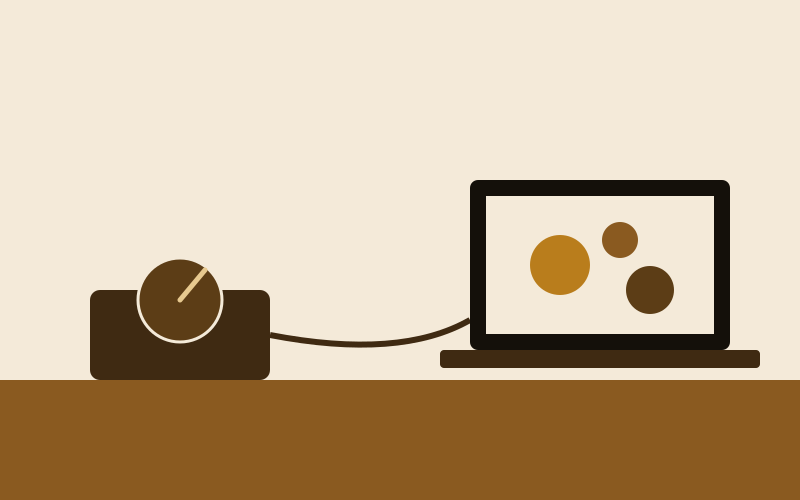
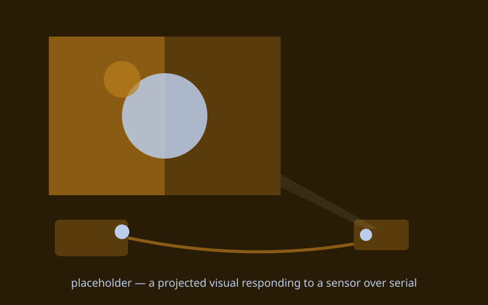

{/* _class: impact */}

# Bridging

Serial comms connects the physical-computing pillar to everything else

---

## Recap

- serial data over USB: what a baud rate is, and what goes wrong when
  the two ends don't agree on it
- reading a live sensor stream into a Programming I sketch
- putting the whole loop together: physical input, through the board,
  into code, back out to an effect
- last session before the break — Studio Brief 2 (due week 7) draws on
  everything from weeks 1–6

---

## Matching baud rates

Set a baud rate on the board and match it exactly on the receiving
code. A mismatch doesn't just slow things down — it garbles or drops
the message.

```cpp
Serial.begin(9600);
```

---

## Printing a plain stream

Print the sensor value as plain, simply-delimited text rather than
anything more structured, so the receiving code only needs to split on
that delimiter.

```cpp
Serial.println(value);
```

---

## Reading it into your sketch

That stream picks up in place of a value that used to come from the
mouse or the clock — your week 3 creative-coding sketch, or the
digitizing pipeline from weeks 1–2, can use it directly.

```javascript
function readSerial(data) {
  let value = int(data); // was mouseX
}
```

---

## Sending something back

Send something back out to the board — even a computed value into a
week 5 LED or motor — so the loop is a genuine round trip, not a
one-way stream of data disappearing into a laptop.

---

## What this can build toward: a physical dial driving a live visual



A knob or sensor read on the board, streamed over serial into a
generative sketch, changing what's on screen live rather than through a
mouse or a slider.

---

## What this can build toward: a projection that reacts to a sensor



A webcam feed or projected visual that visibly shifts when a physical
sensor reading arrives over serial — the digitizing and physical
computing pillars meeting through the same plain, delimited stream.

---

{/* _class: banner */}

## Next week

Over the break, nothing is due. First week back: Programming II —
state machines, and Studio Brief 2's crit
