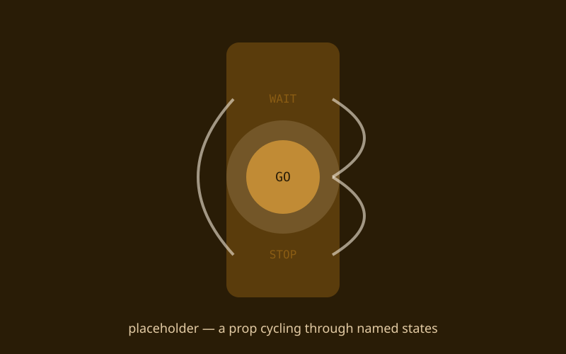
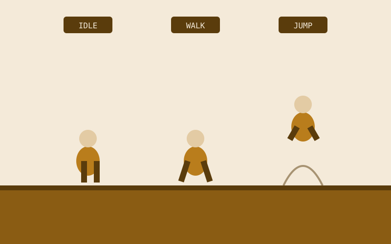

{/* _class: impact */}

# States

A program that behaves differently depending on what happened before

---

## Recap

- "the program is in one of a few states" is a useful way to think about
  interactive work, physical or on-screen
- input handling needs debouncing and edge-detection, or the same button
  press fires the transition three times
- today's crit looks at Studio Brief 2 — the loop closed all the way from
  sensor to microcontroller to program to physical effect
- next week composes today's single state machine into something bigger

---

## Building a state machine, step by step

1. Name a fixed, small set of states up front — `IDLE`, `WAITING`,
   `TRIGGERED`, whatever your behaviour actually needs — before writing
   any logic that uses them.
2. Hold the current state in exactly one variable. If two variables can
   disagree about what state you're in, you don't have a state machine
   yet, you have a bug waiting to happen.
3. Write the update step: given the current state and the input this
   tick, decide whether to transition, and to what. This is the only
   place state is allowed to change.
4. Debounce and edge-detect the input feeding that update step — react to
   the moment a button *becomes* pressed, not to every tick it's held
   down, or one physical press becomes several transitions.
5. Write a render step that only reads the current state to decide what
   to show or do — it never changes state itself. Keeping that separation
   is what stops rendering order or frame timing from quietly becoming
   part of your logic.

---

## What this can build toward: a prop that cycles named states

A turnstile, a traffic-light-style light, or any small physical or
on-screen prop that visibly steps through a named sequence of states on
each trigger — the whole build is one variable and one update step.

---

## What this can build toward: a character with idle, walk and jump

An on-screen character whose state machine has exactly three states —
`IDLE`, `WALK`, `JUMP` — with input deciding the transitions and the
render step just drawing whichever one is current.

---

{/* _class: banner */}

## Next week

Programming II continued — composing state machines into a small rule
system or game-engine loop
