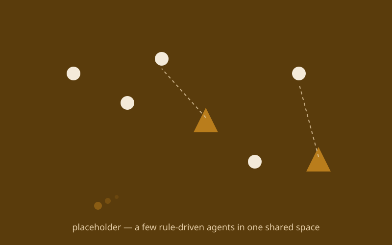
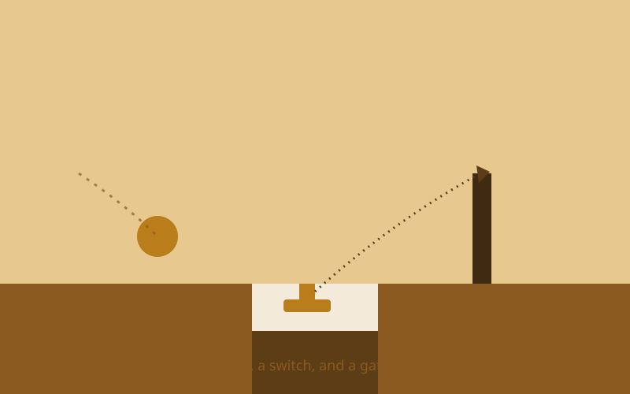

{/* _class: impact */}

# Rules

Several pieces of state, interacting under a consistent set of rules

---

## Recap

- last week's state machine composes into something larger: a small rule
  system or game-engine loop
- the loop has one shape every tick — an update step, then a render step
- the line between "a system with rules" and "a scripted sequence" matters
  for how your final project is judged
- studio time today: extend a rule system with one interaction of your own

---

## One loop, ticking forever

A game loop runs once, forever, ticking at a steady rate — rather than
reacting only when something happens.

---

## Update first, render second, always

```javascript
function tick() {
  update();  // advance every piece of state by one step
  render();  // only reads state to decide what to draw — never changes it
}
```

`update()` runs first and advances every piece of state by one step,
including any state machines from last week. `render()` runs second and
only reads that state. Letting render code change state is how bugs start
depending on drawing order instead of your rules.

---

## Compose parts, don't grow one machine

Build a rule system out of several small, independent pieces of state
that interact — not by growing one state machine to do everything. A rule
system is made of parts, not one part rewritten to cope.

---

## Pick one small interaction

Pick one interaction small enough to build in a session — one that
changes how two existing pieces of state affect each other. A collision,
a trigger, a condition that only matters when two other things are true.

---

## Give it its own state, and check it against the rules

```javascript
let interactionState = "waiting"; // changed only inside update()
```

Change the interaction's state only in the update step, alongside the
states already running, and let it read other state machines' state
rather than reach in and change it directly — reaching in is usually a
sign the boundary is wrong. Then check the result against the "rules vs.
scripted sequence" line: a scripted sequence plays a fixed order back
regardless of state; a rule system produces combinations you didn't
explicitly author.

---

## What this can build toward: a small rule-driven ecosystem



A handful of simple agents — predators, prey, particles — each running
its own small state machine, producing group behaviour none of them was
individually scripted to perform.

---

## What this can build toward: a simple physics-driven level



A small rule-based game level where collision and simple physics are the
rules, and the interesting behaviour — a ball knocking a switch, a switch
opening a gate — is the composition, not any single scripted moment.

---

{/* _class: banner */}

## Next week

Complex Physical Media I — camera-based vision and tracking, and the Final
Planning & Ideation crit
