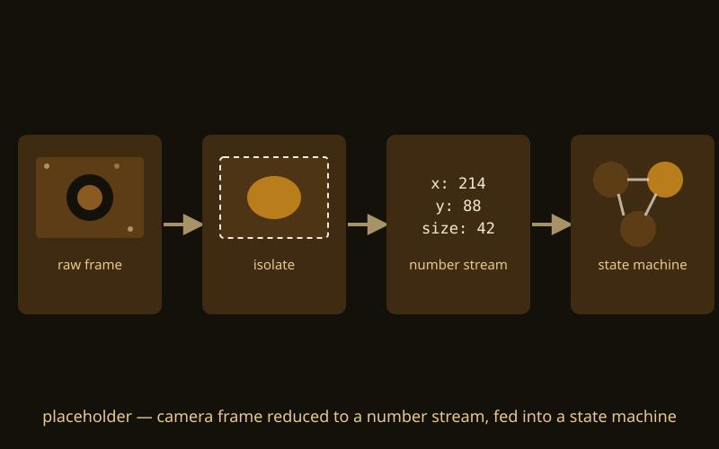
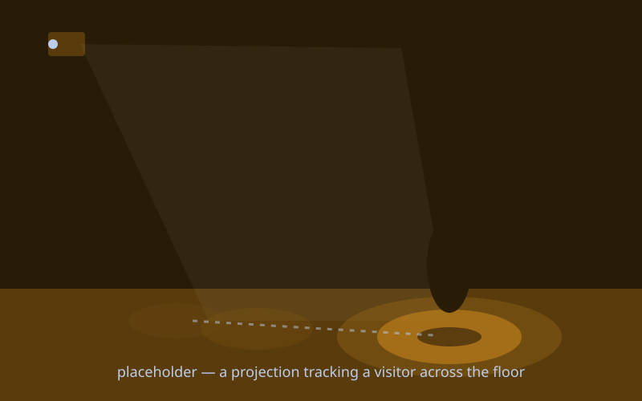
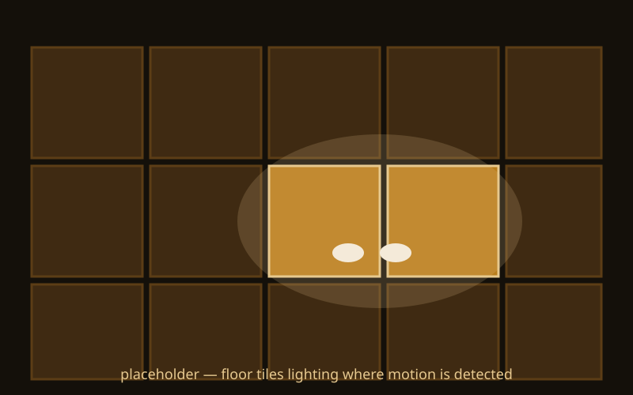

{/* _class: impact */}

# Tracking

A camera feed, watched live, rather than a single photo taken once

---

## Recap

- a tracking pipeline captures continuous position and motion, not one
  static shape the way weeks 1–2's scanning did
- the round-trip pillar turns its final corner: physical media, but live
  rather than captured once
- tracked input is designed to feed straight into the state machines and
  rule systems from weeks 7–8
- today's crit is Final Planning & Ideation — pitching the final's theme
  and technique combination

---

## The tracking pipeline



A live feed is a new capture every frame, arriving continuously rather
than once. Getting from that to something a state machine can use runs
through four steps: isolate, reduce, smooth, feed in.

---

## Isolate what you're tracking from the background

```javascript
const diff = Math.abs(currentFrame[i] - previousFrame[i]);
if (diff > threshold) motionPixels.push(i);
```

Simple motion or frame-differencing finds what changed between two
frames. Colour or blob tracking instead looks for a particular hue or
shape, wherever it is in the frame.

---

## Reduce it to a number stream

Reduce the isolated region to a small continuous number stream — an x/y
position, a size, a count — the same way a sensor reading from week 4 was
a number your code could use.

---

## Smooth it, then feed it in like a sensor

Smooth or threshold that stream so noise between frames doesn't read as a
state change on its own. Then feed the resulting stream into a state
machine or rule system from weeks 7–8 exactly as if it were a sensor —
transitions triggered by what the camera now sees, not what a button
reports.

---

## What this can build toward: a projection that follows a visitor



A projected shape or pattern whose position is driven directly by a
tracked visitor's position in the room — the tracked x/y stream from
today, updated every frame, is the entire input.

---

## What this can build toward: a floor or wall triggered by presence



An interactive floor or wall panel whose rule system changes state when
motion is detected in a region — the same debounced, edge-detected
transition logic from week 7, fed by a camera instead of a button.

---

{/* _class: banner */}

## Next week

Complex Physical Media II — fabrication: 3D printing and laser cutting close
the loop back to physical form
