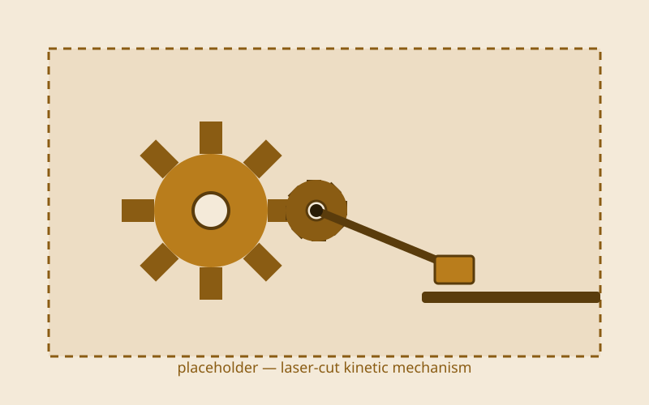
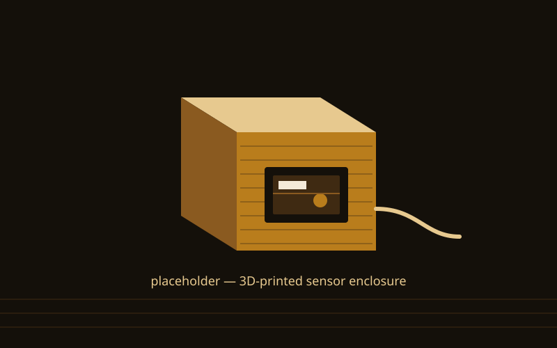

{/* _class: impact */}

# Fabrication

Data becomes matter again — the round trip's return leg

---

## Recap

- 3D printing and laser cutting: what each is good at, and where each fails
- designing for the machine's constraints rather than designing on screen
  and hoping
- a fabricated part as the physical end of a pipeline that started with
  tracking, a rule system, or a sensor
- studio week next: two parallel clinic tracks before the final

---

## From file to part, step by step

1. Decide printer or laser cutter first — a laser cuts a 2D path through
   flat sheet material, a printer builds up an actual 3D volume; a design
   suited to one is often unusable on the other.
2. Get the file checked by a tutor before any job runs — the lab is
   supervised only, and this is the real gate, not a formality.
3. Design around the machine's own constraint: a laser needs a kerf
   allowance built into any slotted joint, a print needs enough wall
   thickness plus the right orientation and supports for overhangs.
4. Run the checked file and collect the part — then check it against the
   digital model before calling the job finished.

---

## What this can build toward: a laser-cut kinetic mechanism

Gears, a linkage, or a simple moving toy cut from cardboard or thin ply —
the kerf allowance from step 3 is what decides whether the pieces actually
mesh once they're off the bed.

---

## What this can build toward: a 3D-printed enclosure

A housing built around a sensor or small circuit from your physical
computing work — wall thickness and orientation decide whether it survives
being printed at all, let alone snaps together afterwards.

---

{/* _class: banner */}

## Next week

Studio week — two parallel clinic tracks, code clinic with Idris and make
clinic with Marisol, to shore up your weaker half before the final
