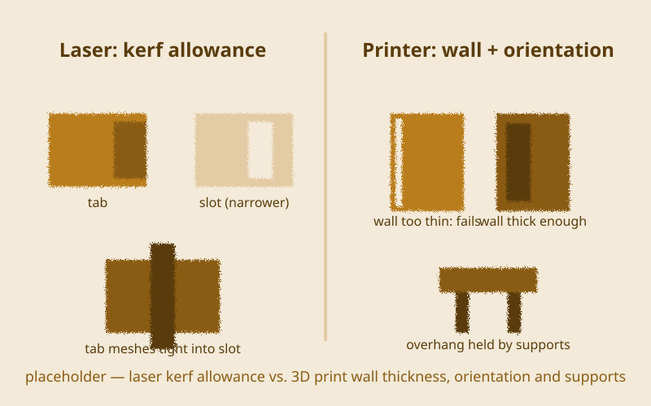

{/* _class: impact */}

# Fabrication

Data becomes matter again — the round trip's return leg

---

## Recap

- 3D printing and laser cutting: what each is good at, and where each fails
- designing for the machine's constraints rather than designing on screen
  and hoping
- a fabricated part as the physical end of a pipeline that started with
  tracking, a rule system, or a sensor
- studio week next: two parallel clinic tracks before the final

---

## Printer or laser cutter, decided first

A laser cuts a 2D path through flat sheet material. A printer builds up an
actual 3D volume, layer by layer. A design suited to one is often
completely unusable on the other, so this is the first decision, not an
afterthought once you're at the machine.

---

## Get the file checked before it runs

The lab is supervised only. Getting your file checked by a tutor before
any job runs is the real gate here — not a formality you can skip because
you're confident it's fine.

---

## Designing around the machine's own constraint

A laser needs a kerf allowance built into any slotted joint — cut the slot
slightly narrower than the tab that meshes into it, or the pieces won't
hold together. A print needs enough wall thickness, plus the right
orientation and supports for anything that overhangs.

---

## From checked file to finished part

Run the checked file and collect the part — then check it against the
digital model before calling the job finished.

---

## What this can build toward: a laser-cut kinetic mechanism

Gears, a linkage, or a simple moving toy cut from cardboard or thin ply —
the kerf allowance built into the joint is what decides whether the pieces
actually mesh once they're off the bed.

---

## What this can build toward: a 3D-printed enclosure

A housing built around a sensor or small circuit from your physical
computing work — wall thickness and orientation decide whether it survives
being printed at all, let alone snaps together afterwards.

---

{/* _class: banner */}

## Next week

Studio week — two parallel clinic tracks, code clinic with Idris and make
clinic with Marisol, to shore up your weaker half before the final
